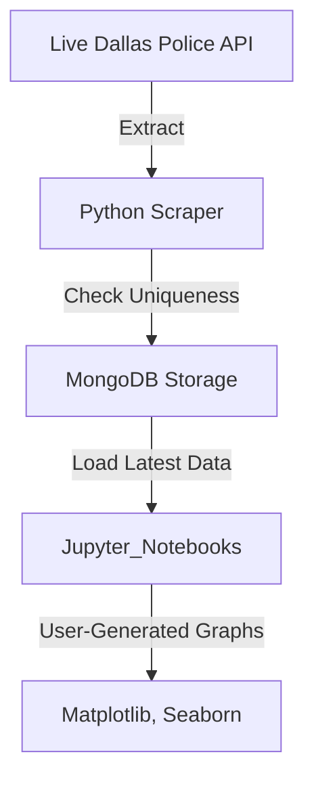

# **Dallas Police Data Pipeline 🚔**  
🚀 **Real-time Incident Tracking & Analysis with MongoDB & Jupyter Notebooks**  

## **📌 Overview**  
This project builds a **real-time data pipeline** to collect, process, and analyze **Dallas Police Department (DPD) incident reports**. The system:  

✅ **Scrapes data every 2 minutes** using a **Python script scheduled with crontab**  
✅ **Ensures data integrity** by checking for duplicate incidents before insertion  
✅ **Stores all data in MongoDB** for flexible, schema-less storage  
✅ **Loads MongoDB data into Jupyter Notebooks** for **real-time interactive analysis**  
✅ **Allows custom graph generation** based on user input  

### **🛑 Important Limitation**  
💡 **The database only contains incidents recorded while my laptop was online.** This was done **to reduce unnecessary cloud computing costs**, as cloud storage was **not required for this project**.  

---

## **📂 Data Pipeline Architecture**  



1️⃣ **Extract:** Pulls live **Dallas police incident reports** via the **Socrata API**  
2️⃣ **Transform:** Cleans, timestamps, and ensures unique entries using **Pandas**  
3️⃣ **Load:** Stores structured data in **MongoDB**  
4️⃣ **Analyze:** **Jupyter Notebooks** retrieve the latest data and generate **real-time graphs**  

---

## **🛠️ Tech Stack**  

| Category           | Technologies Used |
|--------------------|------------------|
| **Data Extraction** | Python, Socrata API, Requests, Crontab |
| **Data Processing** | Pandas, NumPy |
| **Database** | MongoDB (NoSQL) |
| **Visualization** | Jupyter Notebooks, Matplotlib, Seaborn |

---

## **🚀 Installation & Setup**  

### **1️⃣ Clone the Repository**  
```bash
git clone https://github.com/bryce-ka/dallas_police_db.git
cd dallas_police_db
```

### **2️⃣ Set Up a Virtual Environment**  
```bash
python -m venv venv
source venv/bin/activate  # Mac/Linux
venv\Scripts\activate  # Windows
```

### **3️⃣ Install Dependencies**  
```bash
pip install -r requirements.txt
```

### **4️⃣ Start MongoDB Locally**  
```bash
docker run -d --name mongodb -p 27017:27017 mongo
```

### **5️⃣ Schedule Data Scraper with Crontab (Linux)**  
Edit your crontab:  
```bash
crontab -e
```
Add this line to run the script every **2 minutes**:  
```bash
*/2 * * * * /usr/bin/python3 /path/to/data_scrape.py
```

### **6️⃣ Open Jupyter Notebook for Analysis**  
```bash
jupyter notebook
```
Then, run the notebook to generate **live-updating analytics graphs**.  

---

## **📊 Data Schema & Pipeline Flow**  

### **🗄 MongoDB Schema (Incident Reports)**
```json
{
    "incident_number": "25-0285764",
    "division": "Southwest",
    "nature_of_call": "Burglary",
    "priority": 1,
    "date": "2025-02-18",
    "time": "14:30:00",
    "unit_number": "D123",
    "location": "500 Main St",
    "beat": "SW1",
    "reporting_area": "1234",
    "status": "Closed",
    "block": "500 Block"
}
```

### **📡 ETL Pipeline Flow**  
- **Extract:** Retrieves real-time data from the **Dallas Open Data API** (Socrata).  
- **Transform:** Converts timestamps, ensures uniqueness, and handles missing values.  
- **Load:** Inserts data into **MongoDB**, skipping duplicates.  
- **Analyze:** Jupyter Notebook queries **live MongoDB data** and updates graphs in real-time.  

---

## **📈 Analytics & Insights**  

### **✅ Customizable Graphs & Metrics**  
📊 **Crime Trends by Time of Day** – Understand when incidents peak  
📊 **Most Common Call Types** – Identify frequent police dispatch reasons  
📊 **Response Time Analysis** – Measure police unit dispatch times  

### **🔍 Example Graph: Total Incidents by Hour**  
```python
dfc.groupby(dfc['datetime'].dt.hour)['incident_number'].nunique().plot(kind='bar')
plt.title("Total Incidents by Hour")
plt.xlabel("Hour of the Day")
plt.ylabel("Number of Incidents")
plt.show()
```

### **🛠️ Interactive User Customization**  
✅ Users can filter visualizations by:  
- **Specific dates**  
- **Incident types (e.g., burglary, assault, traffic accident)**  
- **Police divisions & response units**  

---

## **📅 Future Enhancements**  
🔹 **Deploy MongoDB to a Cloud Server for 24/7 Availability**  
🔹 **Automate Graph Reports with Scheduled Exports**  
🔹 **Build a Web Dashboard for Live Incident Tracking**  
🔹 **Integrate Machine Learning for Predictive Policing Trends**  

---

## **🤝 Contributing**  
1️⃣ Fork this repository  
2️⃣ Create a feature branch (`git checkout -b feature-new`)  
3️⃣ Commit changes (`git commit -m "Added new feature"`)  
4️⃣ Push to GitHub (`git push origin feature-new`)  
5️⃣ Open a pull request  

---


**Built by [Bryce Anthony](https://www.linkedin.com/in/bryce-anthony/) – AI & Data Science**  
